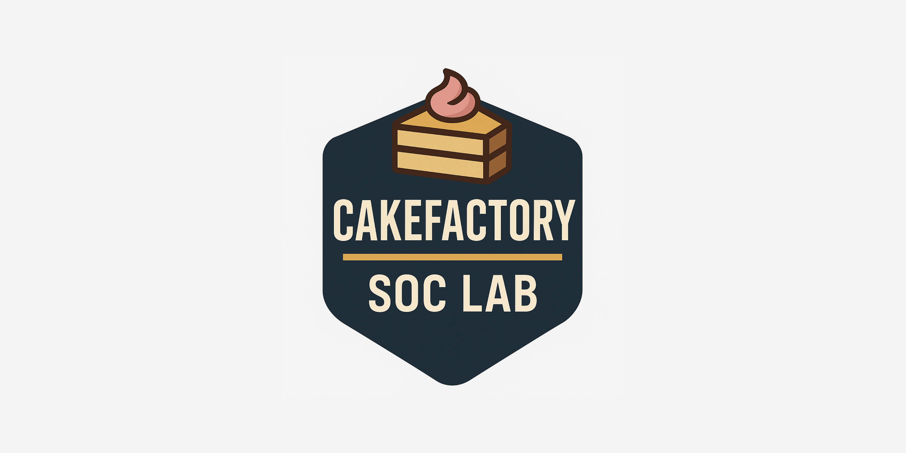
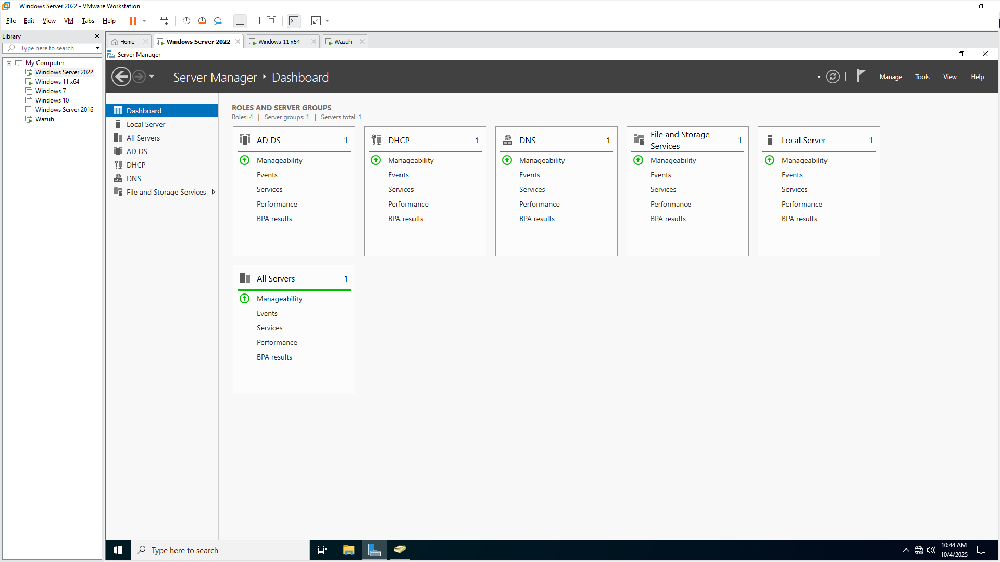
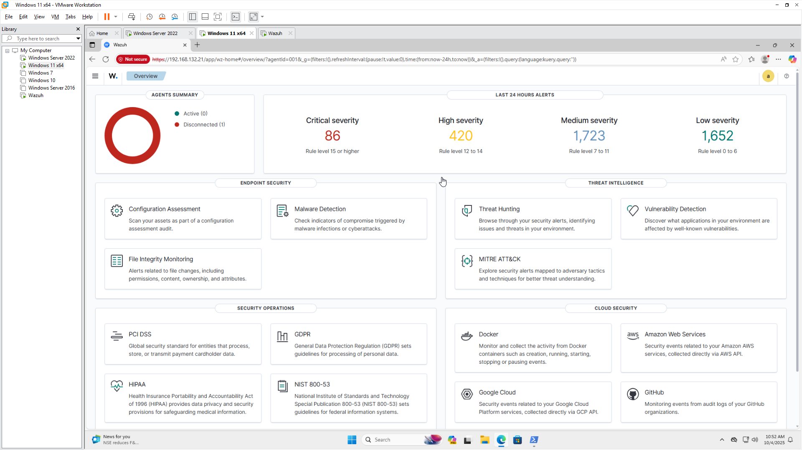
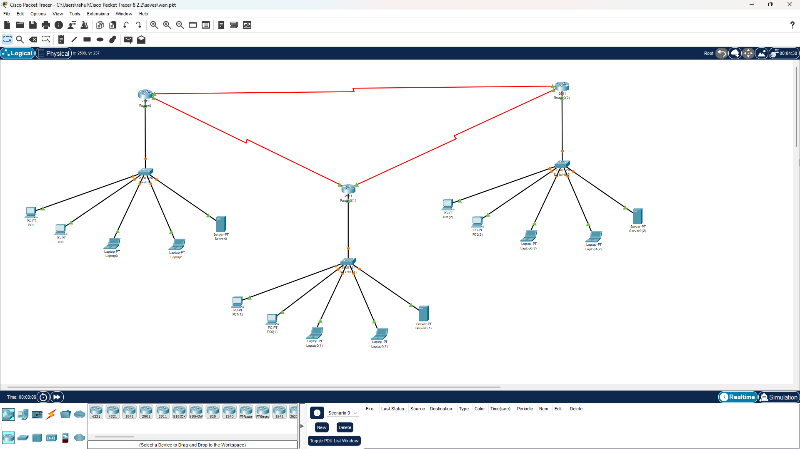
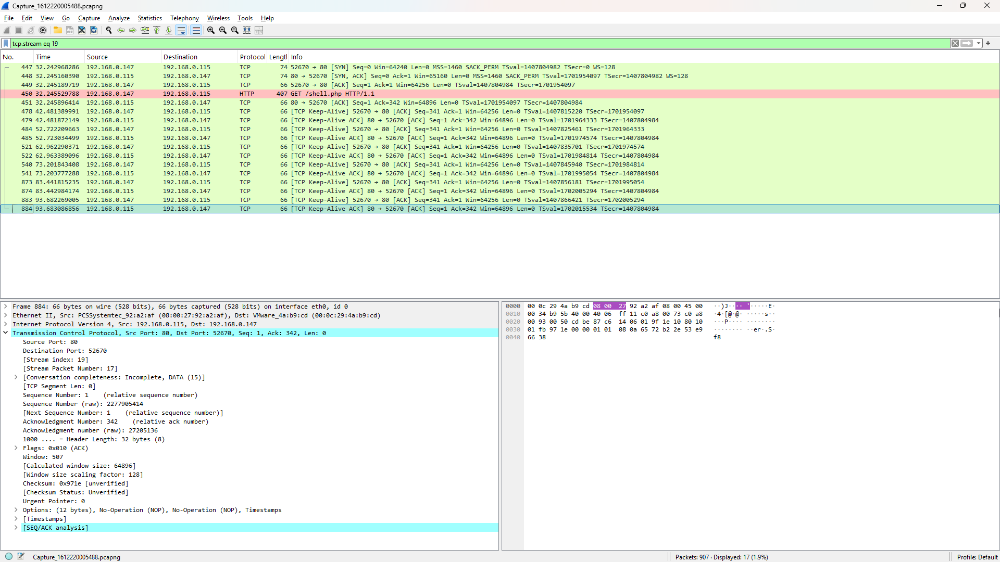
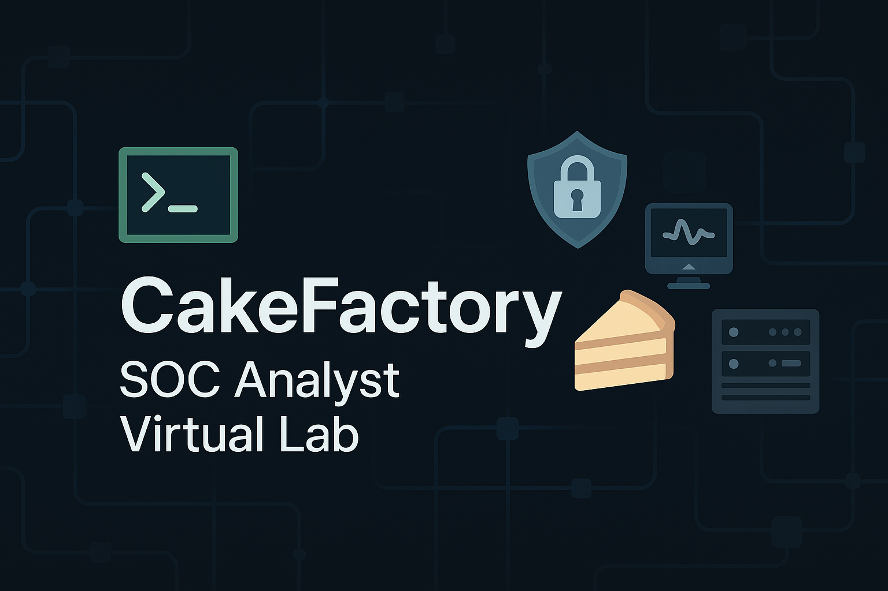

# 🧁 [CakeFactory SOC Lab - Cybersecurity Enterprise Simulation](https://youtu.be/7dvcqdAyq1c)

🚨 Learn how a SOC analyst sets up real-world enterprise defenses — from AD and VLANs to threat detection using Wazuh — all in a simulated Cake-themed company!

  

## 📖 Table of Contents
- [Overview](#-overview)
- [Features](#-features)
- [Skills Practiced](#-skills-practiced)
- [Lab Structure](#-lab-structure)
- [Organizational Users](#-organizational-users)
- [Network Design & VLAN Setup](#-network-design--vlan-setup)
- [SIEM & Monitoring – Wazuh Setup](#-siem--monitoring--wazuh-setup)
- [Packet Capture & Threat Analysis](#-packet-capture--threat-analysis)
- [Screenshots](#-screenshots)
- [About CakeFactory](#-about-cakefactory)
- [Demo](#-demo)
- [Connect With Me](#-connect-with-me)
- [License](#-license)

---

## 📌 Overview

This lab was created during my SOC Analyst training to gain real-world experience in blue team operations. It simulates a small enterprise network with realistic configurations, users, and services.

> ✅ **Tools Used**: VMware, Windows Server 2022/2016, Debian, Wazuh, Wireshark, Packet Tracer  

> ✅ **Concepts Covered**: Networking, Active Directory, Group Policies, DNS/DHCP, VLANs, Threat Detection

## 🌟 Features

- 🏢 Enterprise-like AD domain setup (cakefactory.local)
- 🌐 Multi-branch VLAN simulation (Chennai, HYD, Bangalore)
- 🔐 Real-time log monitoring with Wazuh
- 📡 Packet interception and threat analysis via Wireshark
- 💼 Realistic user accounts and OU structure
- 🧪 Tested on VMware with Windows + Linux systems

---

## 🧠 Skills Practiced

- Core networking concepts (IP addressing, VLANs, routing, switching)
- Deploying and configuring AD DS, DNS, DHCP
- Setting up profile roaming, file sharing, and group policies
- Hosting IIS on member servers
- Deploying Wazuh agents and monitoring logs
- Analyzing packets using Wireshark
- Designing networks using Cisco Packet Tracer
- Simulating and managing real-world enterprise scenarios

---

## 🗂️ Lab Structure

| Role                  | Hostname          | OS                  | Purpose                        |
|-----------------------|-------------------|---------------------|--------------------------------|
| Domain Controller     | `CakeFactory`     | Windows Server 2022 | AD, DNS, DHCP                  |
| Web Server (Member)   | `Eclair-APP01`    | Windows Server 2016 | IIS Web Hosting, DC2Admin      |
| Client 1              | `Cupcake-CL01`    | Windows 11          | End-user machine               |
| Client 2              | `Muffin-CL02`     | Windows 10          | End-user machine               |
| Client 3              | `Brownie-CL03`    | Windows 7           | Legacy system for testing      |
| Linux Endpoint        | -                 | Debian              | Linux user + root simulations  |

---

## 👥 Organizational Users

| Name               | Username     | OU         | Role                        |
|--------------------|--------------|------------|-----------------------------|
| Rin Mizuki         | `rmizuki`    | Interns    | Intern                      |
| Kenji Nakamura     | `knakamura`  | Staff      | Staff Member                |
| Choco Gateaux      | `cgateaux`   | IT         | System Administrator        |
| ...                | ...          | ...        | ...                         |

👉 Full user & password table [here](./docs/users.md)

---

## 🌐 Network Design & VLAN Setup

A multi-branch setup with VLANs and router configs was implemented using Cisco Packet Tracer.

| Branch     | Hostname | Router IP         |
|------------|----------|-------------------|
| Chennai    | CHE      | 192.168.201.1     |
| Hyderabad  | HYD      | 192.168.202.1     |
| Bangalore  | BAN      | 192.168.203.1     |

🛠 VLANs and switch configurations were simulated and tested for inter-branch communication.

👉 View the Configurations: [configs/wan-setup](./configs/wan.pkt)

---

## 🛡️ SIEM & Monitoring – Wazuh Setup

- Wazuh Manager deployed on DC
- Agents installed on all Windows + Linux machines
- Log forwarding and integrity checks configured
- Alerts tested with simulated failed logins and malware detection

📷 View: [screenshots/wazuh-4.png](./screenshots/wazuh-4.png)

---

## 🔍 Packet Capture & Threat Analysis

- Monitored DHCP, DNS, and SMB traffic
- Analyzed ARP spoofing and ICMP traffic
- Logged suspicious events and correlated with Wazuh alerts

---

## 📸 Screenshots

  
*Active Directory with organizational units and users*

  
*Real-time alerts and threat visualization in Wazuh*

 
*Simulated enterprise network using Cisco Packet Tracer*

  
*Captured packet breakdown and event correlation*

👉 See all the screenshots: [here](./docs/screenshots.md)

---

## 🧁 About CakeFactory

CakeFactory is a small-to-medium fictional enterprise designed for SOC simulations Inspired by themed names, it helps make complex systems easier to manage and demonstrate.

---

## 🎥 Demo

  

👉 Click here to view the demo on youtube: [Click Here](https://youtu.be/7dvcqdAyq1c)

---

## 🤝 Connect With Me

**Rahul Setrakian**  
🔗 Linkedin: [rahulsetrakian](https://www.linkedin.com/in/rahulsetrakian)  
📫 Email: rahul.infosec@proton.me  
📦 GitHub: [github.com/rahulsetrakian](https://github.com/rahulsetrakian)

---

## 📜 License

This lab is for educational purposes only. Feel free to fork and learn from it.

**MIT License**
