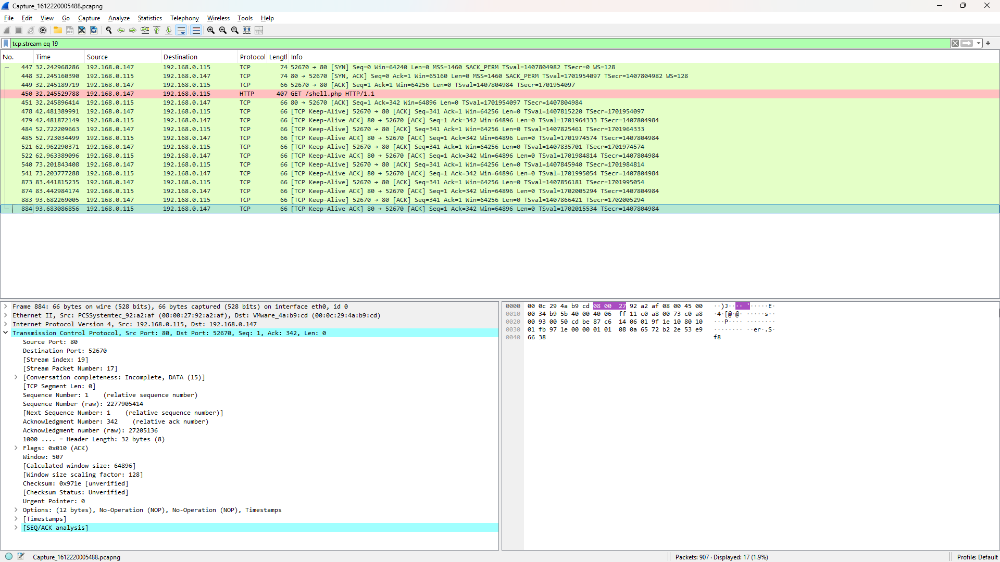

# 📸 Screenshots & Descriptions - CakeFactory SOC Lab

This document lists and describes all key screenshots from the CakeFactory SOC Lab, helping visually demonstrate the setup, services, and configurations.

---

*Windows Server 2022 login screen for the Domain Controller.*

*Windows Server 2022 Server Manager dashboard displaying active roles.*

*Active Directory with organizational units and users.*

*SSH access to the Wazuh server command-line interface.*

*Login page for the Wazuh web interface.*

*Real-time alerts and threat visualization in Wazuh.*

*Wazuh agent dashboard showing endpoint status and vulnerability scan results.*

*Simulated enterprise network using Cisco Packet Tracer.*

*Captured packet breakdown and event correlation.*

---

📁 *Return to main repo:* [CakeFactory SOC Lab](../README.md)
